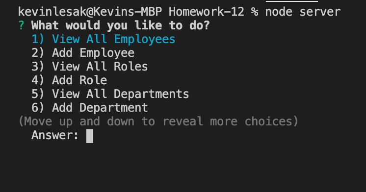
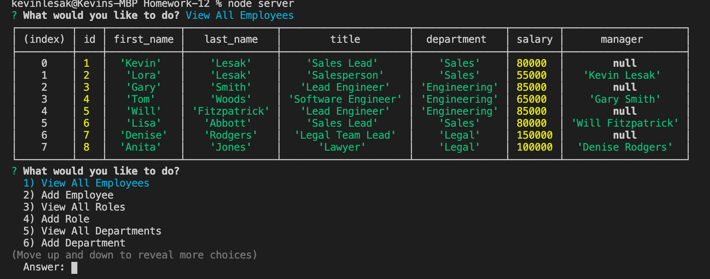
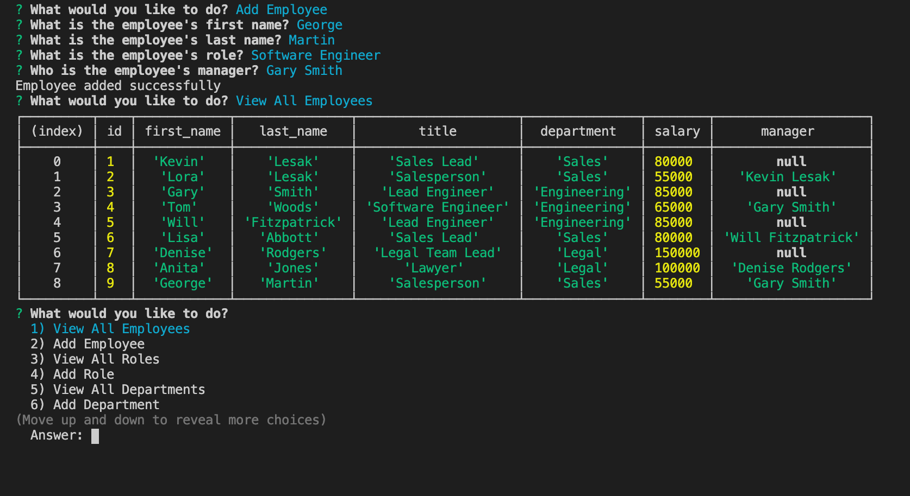
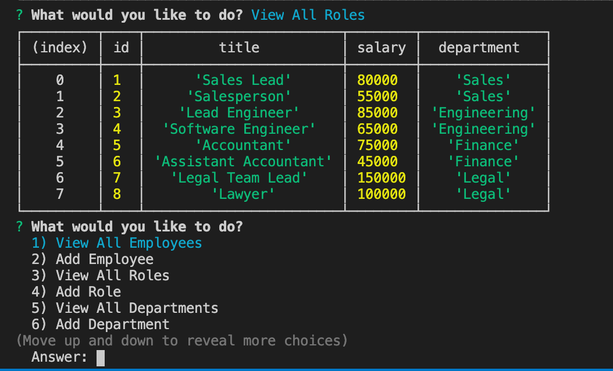
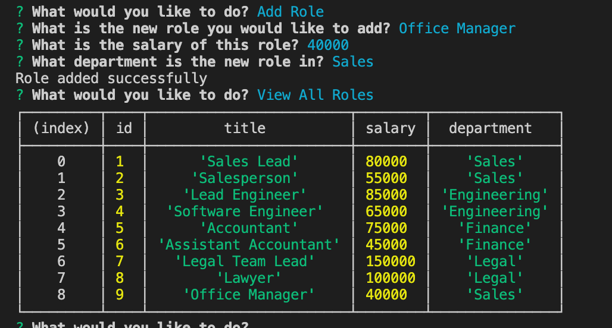
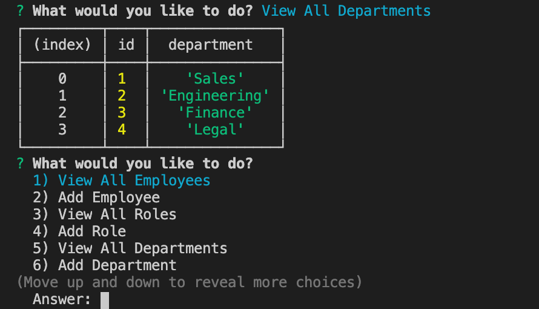
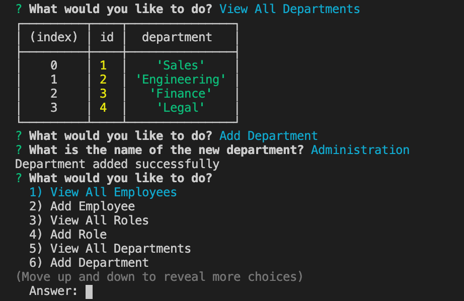
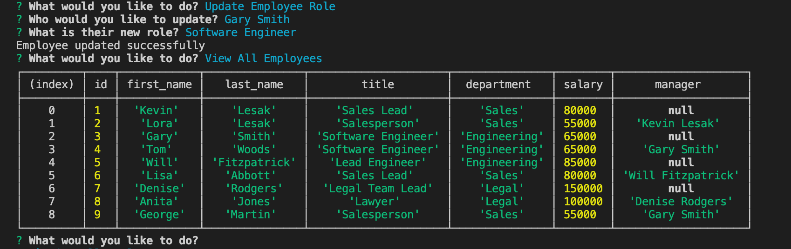

# Homework-12

For this homework assignment, it was required to make an employee tracker using MySQL, Inquirer and console.table npms.

I first set up my three tables for employees, roles and departments with the necessary column names.  I chose not to give a manager_id in the employees table because I was having trouble with my joins.

With multiple functions, I set up a CLI that allows the user to either add or view employees, roles and departments.  It also allows the user to update the role of an employee.

First, when the user runs the app, they are presented with a list of options to choose.  There are seven in total.

If the user chooses to view all employees, the user is presented with the appropriate information from the employee_trackerDB.  There are currently eight employees.

If the user would like to add an employee, the user is asked a series of questions regarding the new employee.  After, the information of the new employee is added to the table, the user can retrieve the new list of employees.

The user can do the same thing for roles.  If the user chooses to view all roles, a table of all roles is shown.

Likewise, the user can choose to add a new role.  The user names the new role and the department to which it belongs.  It is then added to the roles table of the database.

The user can also view all departments.

The user can also add a department in the same way they added employees and roles.

Finally, the user can also update the role of an employee.  As shown below, the user updates one of the employees roles.  When the new table is presented to the user, the new role and other information is updated.

I had a trouble with the joins for this assignment.  I also had a problem creating new arrays from the database information.  Overall, the app has the absolute minimum functionality.

